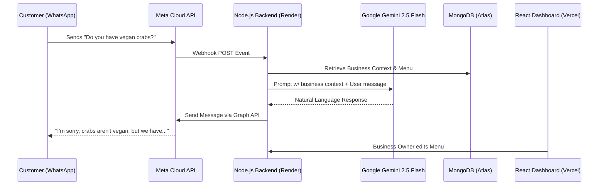
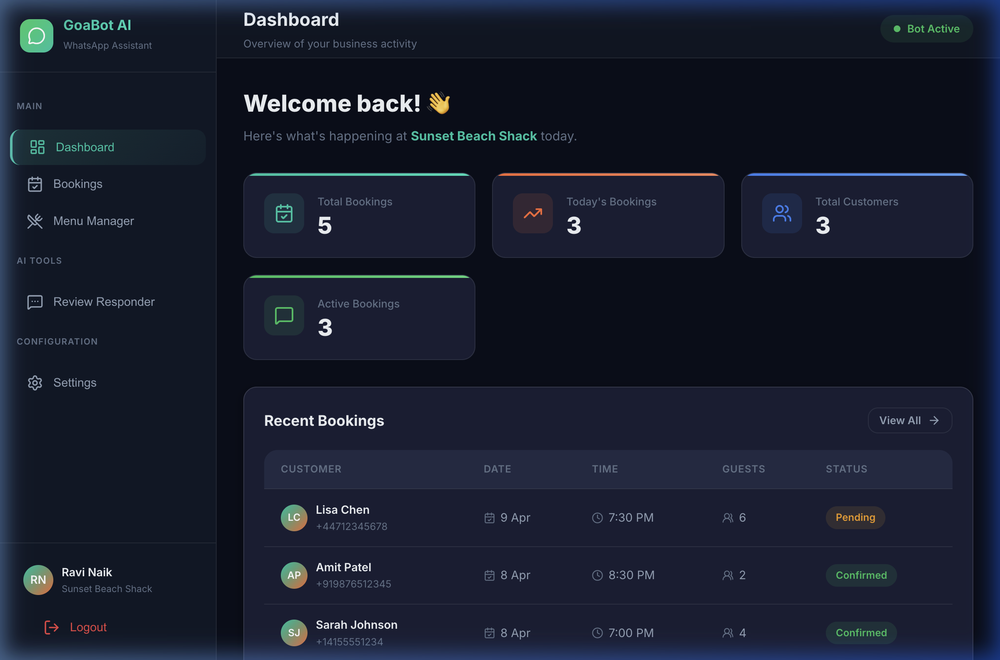
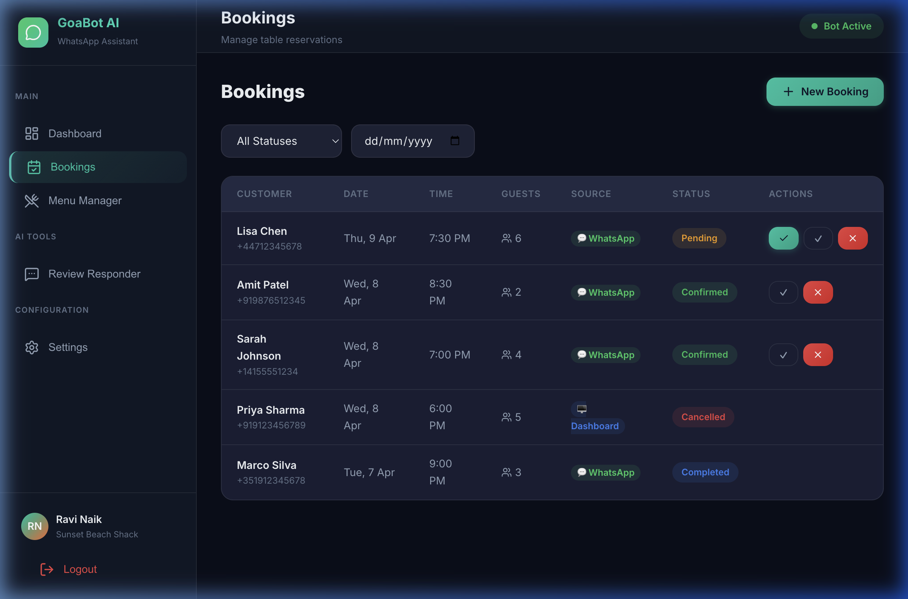
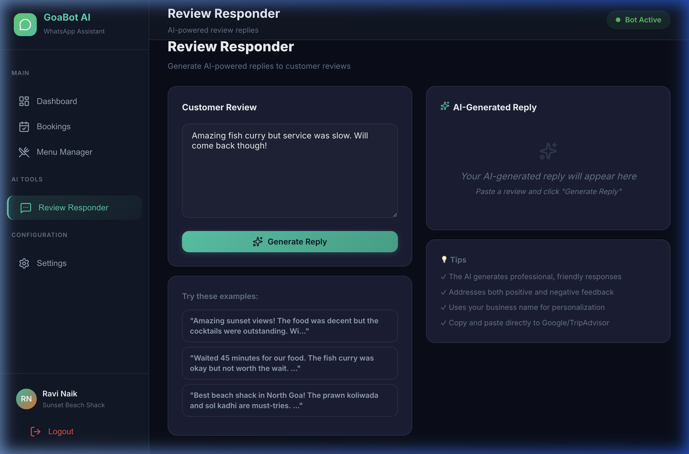
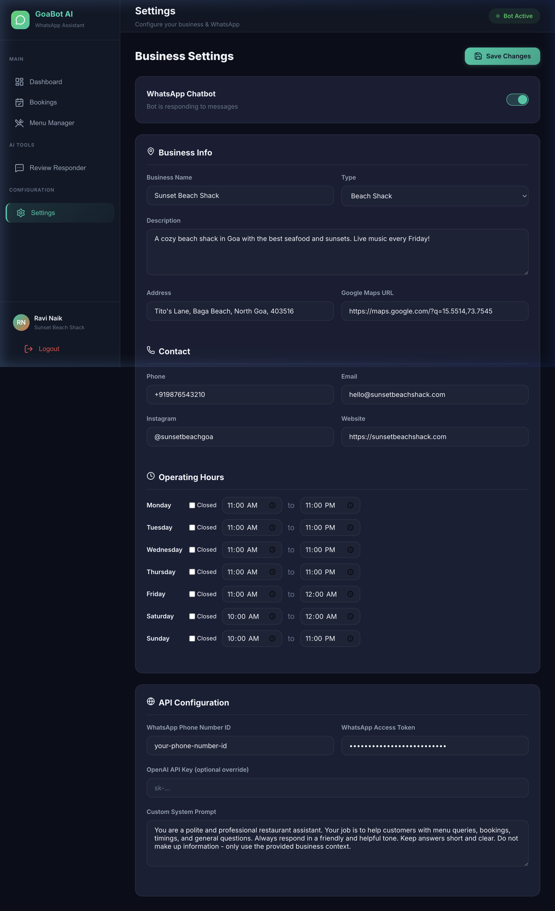

  
  <h1>GoaBot AI</h1>
  
<strong>A Next-Generation Multi-Tenant WhatsApp SaaS for Goa-based Businesses</strong>

  
  
  
  
  

---

## 📖 Executive Summary

**GoaBot AI** is an end-to-end B2B SaaS platform specifically designed to empower the vibrant hospitality sector in Goa, India (Restaurants, Beach Shacks, Homestays). The system automates customer communication using WhatsApp combined with advanced Natural Language Processing. It manages table bookings, shares interactive digital menus, answers frequently asked questions, and automatically generates professional replies to Google Reviews.

This repository holds the full-stack architecture encompassing a highly responsive **React/Vite Admin Dashboard**, a secured **Node.js/Express Backend API**, and a seamless integration with the **Meta WhatsApp Cloud API** and **Google Gemini LLM**.

---

## 🔗 Live Deployments

* **Frontend Dashboard (Live):** [https://frontend-dun-mu-46.vercel.app](https://frontend-dun-mu-46.vercel.app)
* **Backend API (Live):** `https://goabot-ai.onrender.com`
* **GitHub Repository:** [https://github.com/akashmdx2025-crypto/goabot-ai](https://github.com/akashmdx2025-crypto/goabot-ai)

---

## 🏗️ System Architecture

Our platform utilizes a highly scalable headless architecture. Below is the data flow capturing how a customer message translates into an intelligent response.

---

## 🌟 Core Features & Modules

### 1. Unified Analytics Dashboard
The central hub for business owners to overview their daily interactions and system health.

### 2. Intelligent Booking Manager
Customers book tables directly via WhatsApp. The AI detects the intent, captures the time, date, and party size, and automatically pushes the request to the dashboard for 1-click Approval/Rejection.

### 3. Dynamic Menu Context
Owners upload their menu items and prices in the dashboard. This menu is injected directly into the prompt context for the Gemini AI, giving the bot flawless memory of current offerings.

### 4. Review Responder AI
To improve local SEO and Google My Business rankings, owners can paste any customer review into the dashboard. Gemini instantly generates a polite, contextually appropriate response.

### 5. Multi-Tenant Business Settings
Complete isolation of state. Each business manages its own WhatsApp Meta Tokens, specific Google AI Studio Key, operating hours, and custom chatbot tuning.

---

## 🚀 End-to-End Deployment Guide

Below are the exact steps required to clone, configure, and deploy this entire SaaS independently.

### Step 1: Database (MongoDB Atlas)
1. Navigate to [MongoDB Atlas](https://www.mongodb.com/cloud/atlas/register) and provision a forever-free **M0 Sandbox** cluster.
2. In **Database Access**, create a user (e.g., `admin`).
3. In **Network Access**, add the IP Address `0.0.0.0/0` to allow Render's dynamic IP to connect.
4. Copy your Connection String (`mongodb+srv://admin:<password>@cluster0...`).

### Step 2: Backend (Render)
Render powers our Express.js backend, acting as the bridge between WhatsApp and the Database.
1. Connect this repository to your [Render Dashboard](https://dashboard.render.com).
2. Create a new **Web Service**.
3. Select the `backend` Root Directory.
4. Set the Build Command to `npm install` and Start Command to `node server.js`.
5. Apply the following Environment Variables:
   - `NODE_ENV`: `production`
   - `PORT`: `10000`
   - `MONGODB_URI`: *(Your MongoDB connection string from Step 1)*
   - `JWT_SECRET`: *(A random, highly secure string)*
   - `FRONTEND_URL`: `https://frontend-dun-mu-46.vercel.app` (Your frontend URL to satisfy CORS)

### Step 3: Frontend (Vercel)
Vercel hosts the React + Vite administrative UI.
1. Go to [Vercel](https://vercel.com) and import this GitHub repository.
2. Ensure the Framework Preset is detected as **Vite**, and set the Root Directory to `frontend`.
3. Under Environment Variables, add:
   - `VITE_API_URL`: `https://your-render-app.onrender.com/api`
4. Click Deploy.

### Step 4: Activating WhatsApp Cloud API
To turn on live chatting:
1. Create a developer account on the [Meta Developer Portal](https://developers.facebook.com).
2. Create a **Business App** and add the **WhatsApp** product.
3. Locate your **Phone Number ID** and **Access Token**.
4. Log into your live Vercel Dashboard, go to **Settings**, and paste the token values.
5. Back in the Meta portal, configure your webhook:
   - **Callback URL:** `https://your-render-app.onrender.com/api/webhook`
   - **Verify Token:** *(Your custom token found in the backend configuration)*
6. Subscribe to the `messages` event.

---

> [!NOTE]
> **To Convert this documentation to a MS Word DOCX File:**
> Because Markdown is an essential standard for modern repositories, this file is written in `.md`. However, you can instantly turn this into a professional Word document by using macOS native tools:
> Open your terminal and run: `pandoc README.md -o GoaBot_Architecture.docx` (if Pandoc is installed) or simply open this file inside **VS Code -> Right Click -> Export to Word** by installing the *Markdown PDF / Word* extension.

**Licensed under MIT.** Developed for the scalable future of Hospitality in Goa.
